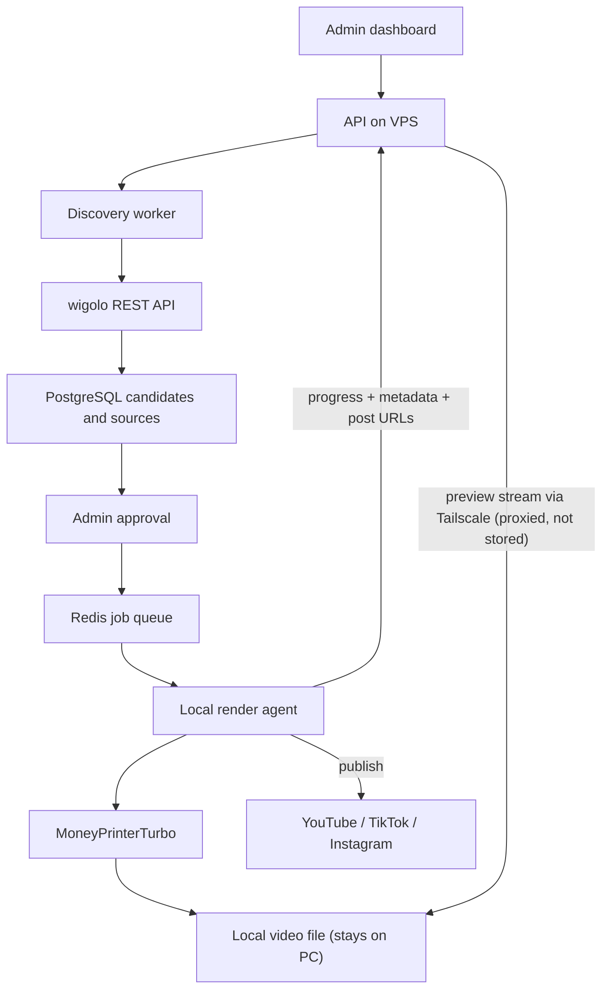

# Viral Video Factory — Implementation Plan for Agent

## 1. Objective

Build a self-hosted workflow that finds timely video/news topics from configurable keywords on a VPS, lets an administrator select one of five curated candidates, and renders an approved topic into a vertical 9:16 video on a local PC.

The final rendered format is `1080x1920`, suitable for TikTok, YouTube Shorts, and Instagram Reels.

### Required pipeline

1. Admin enters a keyword, research prompt, and content settings in a dashboard.
2. VPS searches and collects sources using **wigolo**.
3. The system normalizes, deduplicates, scores, and presents the best five candidates.
4. Admin reviews sources/facts and approves one candidate.
5. VPS creates a render job.
6. A local PC agent securely claims the job.
7. The local agent invokes **MoneyPrinterTurbo** to generate script, footage, TTS, subtitles, music, and final video.
8. The rendered video **stays on the local PC** (it is never uploaded to the VPS). The agent reports only progress and metadata to the VPS.
9. The dashboard **previews the video by streaming it from the PC over Tailscale** (the VPS proxies the stream; it never stores the file).
10. The agent **publishes the approved video to the target platforms**, preferring free official platform APIs for automatic posting, with a manual-download fallback. It reports post URLs and provenance back to the VPS.

## 2. Architecture Principles

- Do **not** merge or heavily modify the upstream wigolo and MoneyPrinterTurbo codebases.
- Build a new orchestration repository that integrates them through adapters and documented APIs/CLI.
- VPS performs discovery, administration, **metadata** storage, and job orchestration. **The VPS never stores rendered video files** — it holds only job metadata, provenance, and published post URLs.
- Local PC performs GPU-heavy or resource-heavy video rendering, **retains the rendered video locally**, and publishes it directly to the target platforms.
- The local PC must not expose a public inbound port to the internet. It connects outward to the VPS with HTTPS and claims jobs through long polling. For preview, the PC and VPS join a private **Tailscale** network so the VPS can proxy the video stream from the PC on demand (no public exposure, no VPS storage).
- An admin approval gate is mandatory before expensive rendering begins.
- Preserve source URLs, publication times, and evidence for every generated video.

## 3. System Topology



## 4. Repository Layout

```text
viral-video-factory/
├── apps/
│   ├── dashboard/                 # Next.js + TypeScript admin UI
│   ├── api/                       # FastAPI API, auth, orchestration endpoints
│   ├── discovery-worker/          # Python worker: retrieval and candidate scoring
│   └── local-render-agent/        # Python service installed on the local PC (render + preview server + publisher)
├── packages/
│   ├── contracts/                 # Pydantic schemas + generated TypeScript client
│   ├── database/                  # SQLAlchemy models and Alembic migrations
│   ├── shared/                    # logging, config, security utilities
│   └── prompt-templates/          # research, validation and script prompt templates
├── integrations/
│   ├── wigolo/                    # wigolo REST client and result mapper
│   └── money-printer-turbo/       # MPT API/CLI adapter and output parser
├── publishers/
│   ├── youtube/                   # YouTube Data API v3 uploader (free, OAuth)
│   ├── tiktok/                    # TikTok Content Posting API uploader (free, OAuth)
│   ├── instagram/                 # Instagram Graph API uploader (free, OAuth)
│   └── manual/                    # Manual fallback: local download + checklist
├── infrastructure/
│   ├── vps/                       # Docker Compose, reverse proxy, environment samples
│   └── local-pc/                  # MPT + local agent installation/configuration
├── docs/
│   ├── architecture.md
│   ├── api-contract.md
│   ├── deployment-vps.md
│   ├── deployment-local-pc.md
│   └── content-policy.md
├── tests/
│   ├── unit/
│   ├── integration/
│   └── e2e/
├── .env.example
├── docker-compose.dev.yml
└── README.md
```

## 5. Technology Choices

| Area | Choice | Reason |
| --- | --- | --- |
| Dashboard | Next.js, TypeScript, Tailwind, shadcn/ui | Fast admin UI and type-safe frontend |
| API | FastAPI, Python 3.11+ | Aligns well with MoneyPrinterTurbo and workers |
| Database | PostgreSQL | Reliable relational data and JSON support |
| Queue | Redis + Celery or Dramatiq | Retryable async jobs and progress events |
| Realtime status | Server-Sent Events initially | Simple dashboard progress streaming |
| Video storage | **Local PC only (no VPS/object storage)** | Rendered files stay on the PC; VPS stores metadata + post URLs only |
| Preview delivery | **Tailscale** (private mesh) + VPS reverse-proxy stream | Preview from dashboard without public inbound port or VPS storage |
| Publishing | **Free official platform APIs** (YouTube Data API v3, TikTok Content Posting API, Instagram Graph API) with **manual fallback** | Automatic posting at no per-post cost; manual download when API/OAuth unavailable |
| VPS deployment | Docker Compose + Caddy/Nginx | Reproducible deployment and TLS |

## 6. Upstream Integrations

### wigolo on VPS

Run wigolo as a local protected REST service. Use it only through the adapter in `integrations/wigolo`.

Primary operations:

- `search`: execute query variations in parallel.
- `fetch`: retrieve selected pages.
- `extract`: extract article metadata and structured content.
- `cache`: prevent repeated work for the same keyword.

Store raw normalized results and never rely solely on an LLM summary.

### MoneyPrinterTurbo on Local PC

Run MoneyPrinterTurbo locally, independently from the VPS. The adapter must invoke its documented API first; use CLI only if an API capability is unavailable.

Required configuration passed to MPT:

- vertical 9:16
- `1080x1920`
- Indonesian or selected language
- target duration
- LLM provider/model
- TTS provider/voice
- subtitle style
- footage provider/preferred sources
- background music profile

Do not expose MPT directly to the public internet. The rendered file stays on the PC; it is not uploaded to the VPS.

### Preview delivery over Tailscale

Join the VPS and every render PC to a private **Tailscale** tailnet. The render PC binds a small read-only preview HTTP server (or MPT's own static file server) to its **Tailscale interface only** — never a public interface. To preview a finished video, the VPS API reverse-proxies (streams, with HTTP Range support) from the PC's Tailscale IP to the dashboard. The video is streamed through, **never written to VPS disk or object storage**. If a PC is offline, preview is simply unavailable; publishing state is unaffected.

### Publishing from the Local PC

After render (and admin go-ahead), the agent publishes the local video file directly to the target platforms using free official APIs, then reports the resulting post URLs to the VPS.

Preferred (automatic, free): the platforms' own APIs — **YouTube Data API v3**, **TikTok Content Posting API**, **Instagram Graph API**. These cost nothing per post but require a one-time OAuth app setup and stored refresh tokens (kept on the PC / server env only, never in the database or browser).

Fallback (manual): if a platform's API/OAuth is unavailable or a post fails, the agent marks the target `manual_required`; the admin downloads the file from the local preview and uploads it by hand, then records the post URL in the dashboard.

Credentials for publishing are stored only in local/server encrypted env config, never in database responses or browser code.

## 7. Core Data Model

Create Alembic migrations for these tables:

```text
users
research_runs
research_queries
source_documents
content_candidates
candidate_sources
approvals
render_profiles
render_jobs
render_job_events
video_outputs
publish_targets
```

### Important fields

**research_runs**

- `id`, `status`, `keyword`, `research_prompt`, `language`, `created_by`, timestamps

**source_documents**

- `id`, `canonical_url`, `title`, `publisher`, `published_at`, `fetched_at`
- `excerpt`, `full_text_ref`, `content_hash`, `source_quality_score`

**content_candidates**

- `id`, `research_run_id`, `title`, `summary`, `facts_json`
- `virality_score`, `freshness_score`, `source_score`, `risk_score`, `rank`
- `status`: `proposed | approved | rejected | expired`

**render_profiles**

- `id`, `name`, `aspect_ratio`, `resolution`, `duration_seconds`
- `language`, `voice_config_json`, `subtitle_config_json`, `music_config_json`

**render_jobs**

- `id`, `candidate_id`, `render_profile_id`, `status`, `payload_json`
- `claimed_by_agent_id`, `attempt`, `error_message`, timestamps

**video_outputs** (metadata only — the VPS never stores the file itself)

- `id`, `job_id`, `artifact_type` (`mp4 | mp4_combined | thumbnail | srt | script | provenance`)
- `local_path` (path on the render PC), `agent_id` (which PC holds the file)
- `preview_url` (Tailscale-proxied stream URL, resolved on demand — not a stored file)
- `size_bytes`, `duration_seconds`, `checksum`, `extra`, `created_at`
- Text artifacts (`script`, `provenance`) may be stored inline on the VPS; binary media (`mp4`, `thumbnail`) is referenced by `local_path` + `agent_id` only.

**publish_targets** (one row per platform per job)

- `id`, `job_id`, `platform` (`youtube | tiktok | instagram | other`)
- `mode` (`auto | manual`), `status` (`pending | publishing | published | failed | manual_required | skipped`)
- `post_url`, `platform_post_id`, `error_message`, `attempt`, timestamps

Status flow:

```text
queued -> claimed -> scripting -> assets -> tts -> subtitles -> rendering
-> completed -> publishing -> published
```

`completed` means the render finished and the file is available on the PC (previewable via Tailscale). `publishing`/`published` cover the post-render publishing stage. Failure states: `failed`, `cancelled`, `retry_waiting`, `publish_failed`.

## 8. Candidate Discovery Rules

For every research run:

1. Create 3–8 query variations from the keyword and administrator prompt.
2. Execute searches through wigolo.
3. Fetch the strongest result pages.
4. Canonicalize URLs and deduplicate source documents.
5. Filter by language, date, allowed/blocked domains, and minimum source quality.
6. Group sources referring to the same story/topic.
7. Score each grouped candidate.
8. Return exactly five best candidates, unless fewer pass the safety/quality rules.

### Initial scoring formula

```text
final_score =
  freshness_score * 0.30 +
  source_score    * 0.30 +
  virality_score  * 0.25 +
  relevance_score * 0.15 -
  risk_score      * 0.30
```

All LLM-produced claims must be grounded in stored sources. Display the source links and the captured factual excerpts to the administrator.

## 9. Admin Dashboard Screens

1. **Research Runs** — create, start, stop, and view past discovery runs.
2. **New Research Run** — keyword, research prompt, source filters, period, language, target platform, and render profile.
3. **Candidate Review** — exactly five ranked cards with facts, evidence, sources, risk flags, and approve/reject action.
4. **Render Job Detail** — script preview, job logs, progress, retries, and cancellation.
5. **Render Profiles** — presets for TikTok/Shorts/Reels, duration, voice, subtitle, music, and LLM.
6. **Outputs** — preview the final MP4 (streamed live from the render PC over Tailscale; not stored on the VPS), view thumbnail, SRT, script, and provenance manifest, and see per-platform publish status + post links.
7. **Agent Monitor** — local PC connectivity, version, available disk, last heartbeat, active job, and Tailscale preview reachability.

## 10. API Contract

Implement versioned REST endpoints under `/api/v1`.

```text
POST   /research-runs
POST   /research-runs/{id}/start
GET    /research-runs/{id}
GET    /research-runs/{id}/candidates
POST   /candidates/{id}/approve
POST   /candidates/{id}/reject

GET    /render-profiles
POST   /render-profiles

GET    /render-jobs/{id}
POST   /render-jobs/{id}/cancel
GET    /render-jobs/{id}/events
GET    /render-jobs/{id}/outputs
GET    /render-jobs/{id}/preview        # reverse-proxied stream from PC over Tailscale (Range-supported); no VPS storage
GET    /render-jobs/{id}/publish-targets
POST   /render-jobs/{id}/publish        # trigger publishing to selected platforms

POST   /agents/register
POST   /agents/heartbeat
POST   /agents/claim-job
POST   /agents/jobs/{id}/events
POST   /agents/jobs/{id}/complete       # reports metadata + local_path (no file upload)
POST   /agents/jobs/{id}/fail
POST   /agents/jobs/{id}/publish-result # agent reports platform + post URL (or manual_required)
```

Note: there is **no** artifact-upload endpoint. The agent reports the local file path and metadata on completion; binary media never leaves the PC.

### Render job payload

```json
{
  "job_id": "rj_01...",
  "candidate": {
    "title": "Topik yang disetujui",
    "facts": ["Fakta yang dapat diverifikasi"],
    "sources": [
      {
        "url": "https://example.com/source",
        "title": "Source title",
        "published_at": "2026-07-29T00:00:00Z"
      }
    ]
  },
  "video": {
    "aspect_ratio": "9:16",
    "resolution": "1080x1920",
    "duration_seconds": 45,
    "language": "id-ID",
    "platforms": ["tiktok", "youtube_shorts", "instagram_reels"]
  },
  "creative": {
    "hook": "Optional admin-provided hook",
    "tone": "informative-fast",
    "voice": "id-ID-ArdiNeural",
    "subtitle_style": "bold-center",
    "music_profile": "news-modern"
  }
}
```

## 11. Local Render Agent Requirements

The local agent runs as a service on the PC and must:

- authenticate using a per-agent token stored locally;
- send heartbeat every 30 seconds;
- claim only one job at a time in MVP;
- verify available disk and MPT health before claiming;
- download the job payload and optional local assets;
- invoke the MoneyPrinterTurbo adapter;
- report each stage and append structured logs;
- **keep the rendered file on the local PC** and report its local path + metadata (size, duration, checksum) to the VPS — **never upload the video binary**;
- expose a read-only preview server bound to the **Tailscale interface only**, so the VPS can proxy a live stream to the dashboard on demand;
- after render, **publish the video to the target platforms** using free official APIs (auto), falling back to `manual_required` when an API/OAuth path is unavailable, and report post URLs back to the VPS;
- retry transient failures with exponential backoff;
- never upload secret configuration, API keys, or publishing OAuth tokens.

Use idempotency keys so a network retry cannot create duplicate rendered videos.

## 12. Security and Content Controls

- Put dashboard/API behind authentication; initial version can be single-admin credentials plus secure session cookies.
- Use HTTPS, strong random API tokens, and token rotation support.
- Restrict CORS to the dashboard domain.
- Store LLM/TTS keys and **publishing OAuth tokens/refresh tokens** only in server/local encrypted environment configuration; never in database responses or browser code.
- The render PC's preview server must bind to the **Tailscale interface only** (never `0.0.0.0`/public); the VPS reaches it only over the tailnet and proxies the stream without persisting it.
- Maintain a blocked-domain list and allowed-domain option.
- Flag content involving violence, minors, medical/legal/financial claims, political misinformation, copyright risk, and unverified breaking news.
- Require admin approval for every render in MVP.
- Record a provenance manifest for every output: candidate, sources, timestamps, model settings, script, asset sources, **and published post URLs per platform**.

## 13. Implementation Milestones

### Milestone 0 — Foundation

- Create monorepo structure.
- Add Docker Compose development environment for PostgreSQL, Redis, API, dashboard.
- Implement environment templates, linting, formatting, tests, CI.
- Create database migrations and seed one admin user.

### Milestone 1 — Discovery MVP

- Deploy wigolo on VPS Docker Compose.
- Implement wigolo adapter and discovery worker.
- Implement research run creation, status tracking, source persistence, candidate grouping, and five-candidate result.
- Build dashboard screens for creating a run and reviewing candidates.

### Milestone 2 — Approval and Queue

- Implement candidate approval/rejection.
- Add render profiles.
- Generate immutable render-job payloads and queue them.
- Build job detail screen and SSE progress stream.

### Milestone 3 — Local PC Rendering

- Implement agent registration, heartbeat, claim job, events, completion/failure APIs.
- Build local-render-agent service.
- Implement MoneyPrinterTurbo adapter.
- Test one Indonesian 45-second vertical render end-to-end.

### Milestone 4 — Output Management (no VPS storage)

- **Do not** integrate object storage and **do not** upload the video to the VPS.
- On completion, the agent reports metadata only (local path, size, duration, checksum, provenance). The VPS persists metadata + inline text artifacts (script, provenance) — never the media file.
- Join VPS + render PC to a **Tailscale** tailnet; run a read-only preview server on the PC bound to the Tailscale interface.
- Add a VPS preview endpoint that reverse-proxies (Range-supported streaming) the video from the PC over Tailscale; build the dashboard Outputs screen with an inline `<video>` player fed by that endpoint.
- Add output gallery, provenance view, retry, and cancellation.

### Milestone 5 — Reliability and Scale

- Add batch rendering after single-job pipeline is stable.
- Add job retries, dead-letter handling, notifications, usage/cost metrics, and operational dashboards.
- Add multiple local PCs as rendering agents if needed (preview routes must resolve to the PC that holds each file).

### Milestone 6 — Publishing

- Add `publish_targets` model + migration and the `publishing`/`published`/`publish_failed` statuses.
- Implement free official-API publishers on the agent: **YouTube Data API v3**, **TikTok Content Posting API**, **Instagram Graph API** (one-time OAuth app setup; refresh tokens stored in PC/server env only).
- Implement the **manual fallback**: mark target `manual_required`, let the admin download from the Tailscale preview and record the post URL.
- Add publish endpoints (`POST /render-jobs/{id}/publish`, `POST /agents/jobs/{id}/publish-result`) and a dashboard publish panel showing per-platform status + post links.
- Publishing runs only after admin go-ahead; every posted video keeps its provenance manifest with the resulting post URLs.

## 14. Definition of Done for MVP

The MVP is complete only when an administrator can:

1. Enter a keyword and prompt from the dashboard.
2. Receive up to five deduplicated, source-backed candidates.
3. Review and approve exactly one candidate.
4. Send it to a local PC without public inbound access to that PC.
5. Render a 1080x1920 Indonesian short video using MoneyPrinterTurbo.
6. See live job progress and errors in the dashboard.
7. Preview the final MP4 in the dashboard, streamed from the PC over Tailscale (never stored on the VPS), alongside script, subtitles, and source provenance.
8. Publish the approved video to at least one target platform — automatically via a free official API, or via the manual fallback — and see the resulting post URL recorded against the job.

## 15. Explicit Non-Goals for MVP

- Automatic rendering without admin approval.
- Multi-tenant accounts and billing.
- Public-facing user dashboard.
- Running the rendering pipeline on the VPS.
- **Storing rendered video files on the VPS or in object storage** (video stays on the PC; VPS keeps metadata only).
- **Exposing the render PC on a public inbound port** (preview is Tailscale-only, proxied by the VPS).
- Paid third-party publishing services (e.g. per-post upload APIs) — publishing uses free official platform APIs, with a manual fallback.
- Forking large upstream codebases unless a verified adapter gap requires a minimal pinned patch.

## 16. First Agent Tasks

1. Initialize the monorepo and development Docker Compose stack.
2. Define Pydantic contracts and PostgreSQL/Alembic schema before building UI.
3. Implement the wigolo client with mocked integration tests.
4. Build the research run API and discovery worker.
5. Build only the candidate-review dashboard screen first.
6. Add approval, then create the render queue and local-agent protocol.
7. Integrate MoneyPrinterTurbo only after the job payload is stable.
8. Wire the Tailscale preview (PC preview server + VPS reverse-proxy stream) instead of any artifact upload.
9. Add publishers (YouTube/TikTok/Instagram official APIs) with a manual fallback, plus the publish endpoints and dashboard panel.

